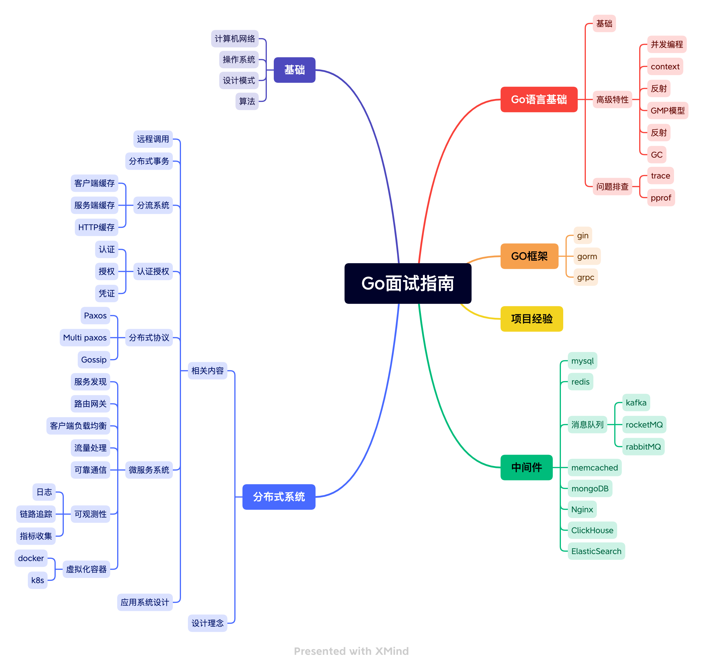

# go-learing
Go语言学习指南相关内容的汇总，包含Go语言基础，go并发，设计模式，编码规范不断更新中。
同时还会对mysql, redis等中间件进行解析，以及介绍分布式系统的相关理论，最终项目经验则以一个分布式系统结尾。

### go基础

#### 基础
- [深入探究for...range语句](./go/基础/深入探究for...range语句.md)
- [defer有什么用呢](./go/基础/defer有什么用呢.md)
- [Go语言中的init函数: 特点、用途和注意事项](./go/基础/Go语言中的init函数.md)
- [Go语言支持闭包吗?说说你对它的理解](./go/基础/Go语言支持闭包吗%3F说说你对它的理解.md)
- [了解Go语言中的panic和recover吗?说说你对它的理解]

#### 函数
- [一文了解Go语言的函数](./go/基础/一文了解Go语言的函数.md)
- [一文了解Go语言的匿名函数](./go/基础/一文了解Go语言的匿名函数.md)
- [一文了解函数设计的最佳实践](./go/基础/一文了解函数设计的最佳实践.md)

#### 结构体和接口
- [一文了解Go语言中的结构体](./go/基础/Go语言中的结构体.md)
- [深入理解Go语言接口](./go/基础/深入理解Go语言接口.md)

#### io操作
- [一文了解 io.Copy 函数](./go/基础/io操作/一文了解io.Copy函数.md)
- [一文了解 io.LimitedReader类型](./go/基础/io操作/一文了解%20io.LimitedReader类型.md)
- [一文了解io.ReadAtLeast函数](./go/基础/io操作/一文了解io.ReadAtLeast函数.md)
- [一文了解io包中的discard类型](./go/基础/io操作/一文了解io包中的discard类型.md)
- [为什么使用ioutil.ReadAll 函数需要注意](./go/基础/io操作/为什么使用ioutil.ReadAll%20函数需要注意.md)
- [SectionReader的使用](./go/基础/io操作/SectionReader的使用.md)

### 并发
- [如何使用Mutex确保并发程序的正确性](./go/并发/如何使用Mutex确保并发程序的正确性.md)
- [不可或缺的并发利器 - Go sync.Once](./go/并发/不可或缺的并发利器%20-%20Go%20sync.Once.md)
- [使用sync.Once实现高效的单例模式](./go/并发/使用sync.Once实现高效的单例模式.md)
- [深入理解Go语言中的sync.Cond](./go/并发/深入理解Go语言中的sync.Cond.md)
- [同步协程的必备工具: WaitGroup](./go/并发/同步协程的必备工具:WaitGroup.md)
- [sync.Pool：提高Go语言程序性能的关键一步](./go/并发/sync.Pool：提高Go语言程序性能的关键一步.md)
- [为什么Sync.Pool不需要加锁却能保证线程安全](./go/并发/为什么Sync.Pool不需要加锁却能保证线程安全.md)
- [Go语言中的原子操作](./go/并发/Go语言中的原子操作.md)
- [Weighted: 实现资源管理](./go/并发/Weighted:实现资源管理.md)

### 常见问题
- [go语言中如何实现同步操作呢](./go/常见问题/go语言中如何实现同步操作呢.md)
- [go语言中实现生产者-消费者模式有哪些方法呢](./go/常见问题/go语言中实现生产者-消费者模式有哪些方法呢.md)
- [协程并发下数据汇总：除了互斥锁，还有其他方式吗](./go/常见问题/协程并发下数据汇总：除了互斥锁，还有其他方式吗.md)
- [为什么需要超时控制](./go/常见问题/为什么需要超时控制.md)
- [如何优雅得关闭协程呢](./go/常见问题/如何优雅得关闭协程呢.md)
- [上游服务不可用了，下游服务如何应对](./go/常见问题/上游服务不可用了，下游服务如何应对.md)
- [Go语言如何判断两个对象是否相等](./go/常见问题/Go语言如何判断两个对象是否相等.md)
- [切片比数组好用在哪](./go/常见问题/切片比数组好用在哪.md)
- [切片有哪些注意事项是一定要知道的呢](./go/常见问题/切片有哪些注意事项是一定要知道的呢.md)
- [自定义结构体，能作为map的key吗](./go/常见问题/自定义结构体，能作为map的key吗.md)
